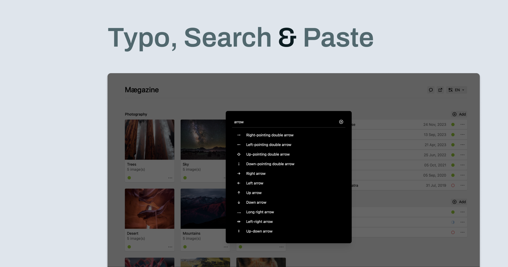

# Typo, Search & Paste

A Kirby plugin that provides a searchable interface for special characters, built on top of [Typo & Paste](https://github.com/philippoehrlein/typo-and-paste).



## Features

- Searchable database of special characters
- Multi-language support
- SQLite-based search engine
- Seamless integration with Typo & Paste (v2.4.0+)
- Standalone functionality for Kirby 5

## Installation

### With Typo & Paste (v2.4.0+)

If you have [Typo & Paste](https://github.com/philippoehrlein/typo-and-paste) v2.4.0 or higher installed, no additional configuration is needed. The search functionality will be automatically integrated.

### Standalone Installation

1. Download and extract the plugin
2. Copy the `typo-search-and-paste` folder into `/site/plugins/`

## Configuration

### Panel Toolbar Button

In Kirby 5, you can add the Typo Search & Paste button to your panel toolbar in two ways:

#### 1. In your blueprint:

```yaml
buttons:
  - typo-search-and-paste
  - preview
  - settings
  - languages
  - status
```

#### 2. Globally in your config:

```php
// site/config/config.php
return [
  'panel' => [
    'viewButtons' => [
      // Page view
      'page' => ['typo-search-and-paste', 'preview', 'settings', 'languages', 'status'],
      // Site view
      'site' => ['typo-search-and-paste', 'preview', 'languages']
    ]
  ]
];
```

## Contributing to the Character Database

The plugin uses  SQLite databases for efficient character searching. You can contribute to the character database by following these steps:

1. Navigate to the `data/src` directory
2. Create or modify JSON files for your language (e.g., `en.json`, `de.json`)
3. Each JSON file should follow this structure:

```json
{
  "characters": [
    {
      "value": "©",
      "name": "Copyright Sign",
      "aliases": ["copyright", "c"]
    }
  ]
}
```

4. Run the build script to update the database:

```bash
php data/src/build.php [options]
```

### Build Script Options

- `--lang`: Specify languages to build (comma-separated)
  ```bash
  php data/src/build.php --lang=en,de
  ```

- `--include`: Include specific categories
  ```bash
  php data/src/build.php --include=math,symbols
  ```

- `--exclude`: Exclude specific categories
  ```bash
  php data/src/build.php --exclude=math,symbols
  ```

Note: `--include` and `--exclude` cannot be used simultaneously. If both are provided, `--exclude` will be ignored.

## License

MIT License

## Credits

This plugin is developed as a companion to [Typo & Paste](https://github.com/philippoehrlein/typo-and-paste)
